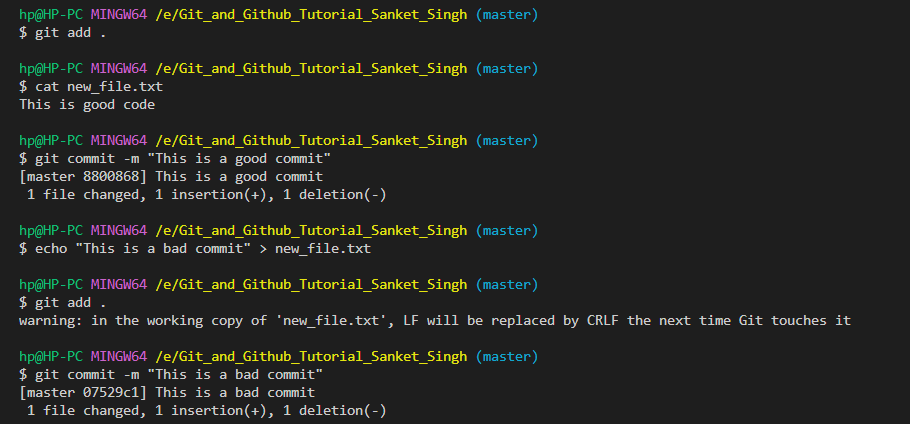
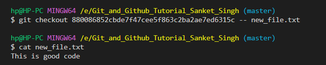
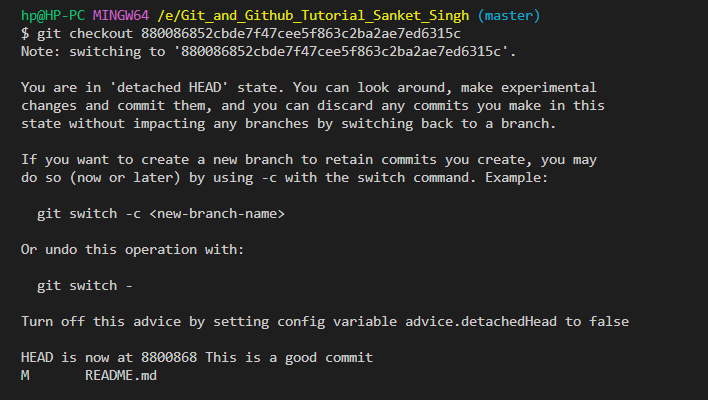

1. `git init` --> Powers your folder to be managed by Git, and initialises a new empty repository. It also creates a .git folder that has also the relevant logic to manage different versions of your project.

2. `Working Area` --> There can be a bunch of files that are not currently handled by git. It means that changes done or to be done in those files are not maanged by git yet. A file which is in working area is considered to be not in the staging area. When we do `git status` and we see a bunch of 'untracked files' then these are actually called to be in the working area.

3. `Staging area` --> What all files are going to be a part of the next version that we will create. This staging area is the place where git knows what changes will be done from the last version to the next version.

4. `Repository area`--> This area actually contains the details of all the previous registered versions. And the files in this area, git already manages them and knows their version history.

5. `git add <file>` --> Moves file from working area to staging area

6. `git rm --cached <file> ` --> Moves file back from staging area to working area

7. `commit` --> git commit is a particular version of the project. It captures a snapshot of the project's staged changes and creates a version out of it.

8. `git commit` --> registers staging changes to a commit. 

9. `git log` --> lists down all the commits of the repository. If you want to exit out of git log, press 'q'.

10. `git restore <file> ` --> two different usecases

Unstaged Changes: If you have made changes to a file in your working directory but have not yet staged those changes, you can use git restore <filename> to discard those changes and revert the file to the state it was in the last committed version.

Example:

git restore myfile.txt

Staged Changes: If you have already staged changes (using git add) but want to unstage them, it cannot be simply done with git restore <filename>. We need to use git restore --staged <filename>.

Example:

git restore --staged myfile.txt

Doing this will move the changes from staging area to working area. Now I can discard the changes from the working area by using `git restore <filename>` as before.

An easy real life analogy to understand about the working area, staging area and the repository :

Think of a mathematics examination. We have an answer sheet and a rough sheet. Now in order to solve the first question, we do some rough work on the rough sheet. That is the working area. Any changes or work that we do in this rough area may/may not work.

What we need to submit to the teacher is the answer sheet, so we copy the solution from the rough sheet to the answer sheet. The answer sheet is the working area.

After the exam gets over, the invigilators click a photograph of the answer sheet for their future records. This is what the repository is.

11. `git diff <commit-id1> <commit-id2>` : Considering commit-id1 to be the previous commit and commit-id2 to be the further commit, it tells the difference between the two commits in terms of additions and deletions of code.

12. `git remote ` --> lists down all the remote connection names.

13. Remote connection --> It helps you to link two git repositories for uploading and downloading changes from each other otherwise.

14. `git remote add <name of remote> <link of the remote> ` : this command helps us to add a new link to the remote repo and give a name to it.

In the command `git remote add origin`, 'origin' just refers to a connection between the local Git repository and the remote repository. Technically, we can use any name for this connection, 'origin' is just a common name for this connection.

15. `git remote rm <name of remote> `: this command deletes a remote connection

16. `git remote rename <oldname> <newname> ` : this command renames the remote connection

17. `git pull <remote name> <branch name>`: downloads latest changes from the branch of the mentioned remote in the local repository.

Merge conflicts is something we need to know how to deal with.

Merge conflicts is something we need to know how to deal with.

### Recommended practice to do

    - make changes
    - git add <file>
    - git commit
    - git pull
    - git push

Important thing to know: Before pulling from remote, the working area and staging area should be clean on the local repository. So, we need to either commit the changes on local or stash them, before pulling.

Merge conflicts are a very common scenario.

### Notes from Git continued video

Concept of upstream and downstream in Git: 

In Git, "upstream" refers to the repository that you forked from, or the "main" repository that you are working on. "Downstream" is the repository that you created from the upstream repository, or the repository that you are contributing to.When you fork a repository, you create a copy of the repository on your own GitHub account. This copy is called the "downstream" repository. You can then make changes to your own copy of the repository and submit a "pull request" to the "upstream" repository, asking the maintainers to review and merge your changes.When you clone a repository, you make a copy of the repository on your local machine. This copy is also called the "downstream" repository. You can then make changes to your local copy of the repository and push them to the "upstream" repository.In both cases, the "upstream" repository is the original repository that you forked or cloned, and the "downstream" repository is the copy that you created.

Q. How to ensure that the downstream repository, or the repository set up on our local is up to date with all the commits from the upstream repository?

A. 

1. Set the upstream connection, by creating `git remote add upstream <upstream-URL>`.

2. Pull from the upstream repository by using `git pull upstream <branch-name>`. For example, using `git pull upstream main` will pull the changes from the `main` branch of upstream repo, and attempt to merge it with the current local branch. If in case the branch name is not specified, the code from the default branch of the repository is fetched. (which is usually the main or the master branch)

3. If there are any merge conflicts, we will be prompted to resolve those. Else, we can proceed.

In the command `git clone <remote URL>` is used to create a local copy of a remote repository, Git typically clones only the default branch (often named "main" or "master") from the remote repository. This behavior is to keep the initial clone lightweight and to avoid downloading the entire commit history and all branches unless explicitly requested.

However, if we have a usecase to clone only a specific branch of a repository, we can do so by using `git clone --branch branch_name --single-branch <repository_url>`. For example, `git clone --branch development --single-branch https://github.com/ `

If we have a usecase to clone all the branches of the, we can do so by using `git clone --mirror <repository URL>`


## Fixing mistakes in Git

If there's a situation that a file is present in both the working area and the staging area, and we use the command `git checkout -- <filename>`, then all the changes made in the working area are lost and only the changes from the staging area remain.

More formally, The command git checkout -- new_file.txt is used to discard any uncommitted changes made to the file new_file.txt in your working directory and replace it with the version of the file from the most recent commit (the version in the HEAD).

The `git clean` command: This command is used to discard all the untracked files in the working area. 


There are several options too available with `git clean`. Let's explore some of them:

1. --dry-run :  This flag is used when we first want to see which untracked files will be removed from the working directory, and not to actually delete those files.

2. -d : This flag is used when we want to include the untracked directories as well.

Q. How to revert changes from a previous commit for a specific file or for all files?

A. 

1. Find the Commit: First, you need to find the commit that contains the version of the file you want to revert to. You can use git log to view the commit history and find the commit hash of the desired commit.

2. Once you have the commit hash, you can use git checkout to revert the file to that specific commit's state. The command syntax is as follows: 

`git checkout <commit_hash> -- <file_path>` 

If in case, we want to revert all the files to previous commit, we can do say by using the syntax `git checkout <commit_hash>`




**Important note about git checkout**

When we use the git checkout command to bring back changes from a previous commit, we also move the HEAD pointer to the previous commit.

This brings us to a point where the HEAD pointer is not directly pointing to a branch (which is the usual behavior), but is pointing to a commit, this is known as 'detached HEAD' state.



There is a risk with using detached head state, let's understand it with the help of an example. Let's say there is a scenario that there are commits numbered 1 to 5 in the commit history. Let's also say that currently the master points to the 5th commit and HEAD points to the master. Now if we want to checkout to the 2nd commit and use `git checkout <2nd commit ID>`, the problem is that there is no reference to the 3rd and the 4th commit (it is similar to losing the address of a node in a linked list). These would become dangling commits, and would be cleaned up by the Git GC. 

But the bottom line is that the master branch still points to the 5th commit, if we want to move back the HEAD pointer to the master, we can do so by using `git checkout master`. Note, that if we move the HEAD pointer to the master (which is in turn is pointing to the 5th commit), we don't require a reference to the 3rd or 4th commit. They would appear in the commit history, because each commit stores information about its parent commit.

I can see two risks in the detached HEAD state:

1. If the master pointer, is by mistake moved to some other commit, then the commit history would be lost.

2. Any new commits you make in a detached HEAD state won't be part of a branch. They'll just hang in the commit history without any reference, and they might eventually get garbage collected if not associated with a branch or tag. If you want to continue working on the changes made in a detached HEAD state, it's essential to create a new branch before making new commits. 

This is how the commit history looks like, in case of detached HEAD:


In order to see the commit history since only for a particular duration, we can do so by using `git log --since="yesterday"` , `git log --since="5 minute ago"`or `git log --since=10.minute` etc

In order to search for a commit with a particular commit message, we can use `git log --grep <search string> `

Usecases of ^ (tilde) and ~ (caret) in git log : 

1. The ~ symbol is used to reference ancestors of a commit. You can specify how many generations of ancestors you want to include in the log. For example, ~1 refers to the immediate parent, ~2 refers to the grandparent, and so on.

2. The ^ symbol is used to reference the parent of a commit. It is used to  specify the immediate parent(s) of a commit. If a commit has multiple parents (in the case of a merge commit), we can use ^ followed by a number to indicate which parent to reference.

Let's understand point 2 in more detail.


A merge commit is a special type of commit in Git that represents the result of merging one branch into another. It's created when you combine changes from one branch (the source branch) into another branch (the target branch). Merge commits have two or more parent commits, where each parent represents one of the branches being merged.

There's another important point worth knowing: merge commits are only created when there are merge conflicts while merging two branches. 

No, a merge commit is not created if there are no merge conflicts and the merge can be performed as a "fast-forward" merge. In a fast-forward merge, Git simply moves the branch pointer of the target branch to the same commit as the source branch because there are no divergent changes to merge.

For example, 

```
# Create a new branch and make some changes
git checkout -b feature-branch
# Make changes and commit
git commit -m "Added feature"

# Switch to the main branch
git checkout main

# Merge the feature branch (fast-forward)
git merge feature-branch

In this scenario, if there are no conflicting changes between feature-branch and main, the merge operation will be a fast-forward merge. It won't create a merge commit; instead, it will move the main branch pointer to the same commit as feature-branch.

```


