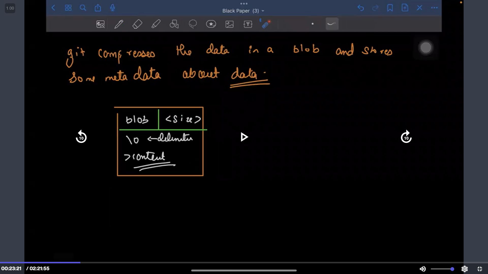

Git internally uses :

1. Hashing
2. Graph/Tree Data Structure

==> Git is like key-value store.

Key used is the hash of the data and value is the data.

The value is not directly stored, it is stored as a structure comprising of the blob, size, delimiter and actual content. [Discussed below]

git uses a cryptographic hash function -> SHA1 (Secure Hash Algorithm 1)

For a given data, it outputs 40 digit hexadecimal number. The hash value is always same for same data.

git compresses the data in a blob (binary large object), and stores some metadata about data.

The exact type of data (value) that git stores varies, explained below:

1. Blob Object: When you add a file to a Git repository, Git creates a blob object to store the content of that file. Blobs represent the actual content of files without any metadata or directory structure. A new blob object is created every time a file's content changes, even if the file's name remains the same.

2. Tree Object: When you add a directory to a Git repository, Git creates a tree object to represent the directory's contents and structure. A tree object contains references to other tree and blob objects, along with metadata such as filenames and mode permissions. This allows Git to represent the directory hierarchy.

3. Commit Object: When you make a commit in Git, it creates a commit object. A commit object represents a specific state of the repository at a given point in time. It includes references to the tree object representing the state of the repository's contents and information such as the author, committer, date, and commit message. If the commit has parent commits (as in the case of non-initial commits and merge commits), those are also referenced.

4. Tag Object: Tags in Git can be either lightweight or annotated. Annotated tags are represented using tag objects. These objects include information about the tagger, date, and an optional message. An annotated tag typically references a commit object that the tag points to.

Structure of how git stores the data:

Let's see the hashing of git in action :

Let's use ` echo 'Hello World' | git hash-object --stdin ` in GitBash or a Linux based shell. What this does is, it passes the string 'Hello World' and generates the 40 digit hexadecimal SHA1 hash, the same way git generates a hash when we commit a file.

We get 557db03de997c86a4a028e1ebd3a1ceb225be238 as the hash for 'Hello World' , regardless of how many times we run the command

Now, let's also try to write this hash, using the command ` echo 'Hello World' | git hash-object -w --stdin `, now if we go and see the .git/objects folder, we see a folder with intials '55' (first two digits of the hash) and a file inside it named '7db03de997c86a4a028e1ebd3a1ceb225be238' (the other digits of the hash).

So, this is technically what happens each time we move a file to the staging area. A unique hash is created by the SHA1 algorithm, and a folder is created inside the `.git/objects` folder, with the folder name as the first two initials of the hash, and a file with the name as the other characters of the hash.

Try this hands on: create a new file with some content, stage it with `git add <filename>`, and look at the contents of `.git/objects`, we'll see a folder and a file created.